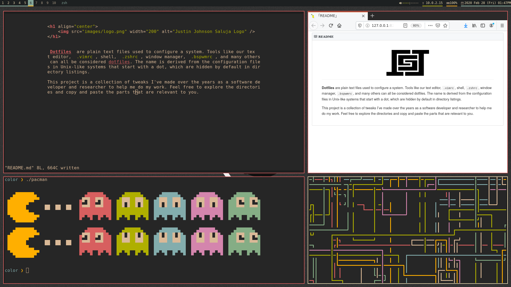

<h1 align="center">
    
</h1>

**Dotfiles** are plain text files used to configure a system. Tools like our text editor, `.vimrc`, shell, `.zshrc`, window manager, `.bspwmrc`, and many others can all be considered dotfiles. The name is derived from the configuration files in Unix-like systems that start with a dot, which are hidden by default in directory listings.

This project is a collection of tweaks I've made over the years as a software developer and researcher to help me do my work. Feel free to explore the directories and copy and paste the parts that are relevant to you. 

<h1 align="center">
    
</h1>
